# Assignment1 in mobileapplication group 16

# Quiz-App

This project is a group assignment for NTNU course IDATA2503, where we are to build an Quiz App for mobile. We will heavily follow a [udemy](https://www.udemy.com/course/learn-flutter-dart-to-build-ios-android-apps/?couponCode=24T4MT90924A) course and add my own features on top of that.

- [About the app](#about-the-app)
- [User stories](#user-stories)
- [Folders And files Structure](#folders-and-files-structure)
- [Class Diagram](#class-diagram)
- [How the group worked](#how-the-group-worked)

## About the app

This is a quizz app developed in flutter using dart. The app is an app with a simple start screen with a "Start quiz" button. That will lead you to a question screen with one question and 4 answers to pick between. When the questions is answered. A resault screen will show up, showing how many answeres were answered correctly, the time spent and a summery showing what the user answered and what was the right answer

## The feature I added

I created a timer that will count the amount of time the user spends on the quiz.
The only classes that was changed was quiz.dart, results_screen.dart. I added a time_widget.dart file,
that is a widget to display the time. 

## User-stories
### User Storie:

I wish there was a way to track the amount of time I spent solving these questions.

### User Answer:
There is now a function to see how much time you are spending during the app, in the right corner there is a timer that shows how long time you are using.

When the quiz is done, the resault screen wil display the amount of time spent on answering the questions

## Folders And Files Structure

### Folders and files
1) The data folder contains the stored values that is used in the application

2) The model data, stores all the models used by the application, not included the time widget. 

3) Questions_summary contains the logic connected to the questions, like how to manage the questions and display them.

4) The rest of the components in the lib file is the screens that is shown when using the app and the logic around how to display them.

## Class Diagram

```mermaid
classDiagram
class AnswerButton
AnswerButton : +answerText String
AnswerButton : +onTap void Function
AnswerButton o-- void Function
AnswerButton : +build() Widget
StatelessWidget <|-- AnswerButton

class QuizQuestion
QuizQuestion : +text String
QuizQuestion : +answers List~String~
QuizQuestion : +shuffledAnswers List~String~

class QuestionsScreen
QuestionsScreen : +onSelectAnswer void FunctionString
QuestionsScreen o-- void FunctionString
QuestionsScreen : +createState() State<QuestionsScreen>
StatefulWidget <|-- QuestionsScreen

class _QuestionsScreenState
_QuestionsScreenState : +currentQuestionIndex int
_QuestionsScreenState : +answerQuestion() void
_QuestionsScreenState : +build() Widget
State <|-- _QuestionsScreenState

class QuestionsSummary
QuestionsSummary : +summaryData List~Map~String, Object~~
QuestionsSummary : +build() Widget
StatelessWidget <|-- QuestionsSummary

class QuestionIdentifier
QuestionIdentifier : +questionIndex int
QuestionIdentifier : +isCorrectAnswer bool
QuestionIdentifier : +build() Widget
StatelessWidget <|-- QuestionIdentifier

class SummaryItem
SummaryItem : +itemData Map~String, Object~
SummaryItem : +build() Widget
StatelessWidget <|-- SummaryItem

class Quiz
Quiz : +createState() State<Quiz>
StatefulWidget <|-- Quiz

class _QuizState
_QuizState : -_selectedAnswers List~String~
_QuizState : -_activeScreen String
_QuizState : -_quizDuration Duration
_QuizState : -_switchScreen() void
_QuizState : -_chooseAnswer() void
_QuizState : +restartQuiz() void
_QuizState : -_handleTimerTick() void
_QuizState : +build() Widget
State <|-- _QuizState

class ResultsScreen
ResultsScreen : +onRestart void Function
ResultsScreen o-- void Function
ResultsScreen : +chosenAnswers List~String~
ResultsScreen : +quizDuration Duration
ResultsScreen : +numCorrect int
ResultsScreen : +numTotal int
ResultsScreen : +summaryData List~Map~String, Object~~
ResultsScreen : +build() Widget
StatelessWidget <|-- ResultsScreen

class StartScreen
StartScreen : +startQuiz void Function
StartScreen o-- void Function
StartScreen : +build() Widget
StatelessWidget <|-- StartScreen

class TimerWidget
TimerWidget : +onTimerTick dynamic FunctionDuration
TimerWidget o-- dynamic FunctionDuration
TimerWidget : +createState() _TimerWidgetState
StatefulWidget <|-- TimerWidget

class _TimerWidgetState
_TimerWidgetState : +duration Duration
_TimerWidgetState : +timer Timer
_TimerWidgetState o-- Timer
_TimerWidgetState : +initState() void
_TimerWidgetState : +startTimer() void
_TimerWidgetState : +dispose() void
_TimerWidgetState : +build() Widget
State <|-- _TimerWidgetState
```

## How the group worked

I did not work in a group for this project, but I can explain how the working process worked.
1) First I was planing what type of function was good to add.
2) I had to find out how I could add the functionality with out interupting or effect the other funtionalities that was allready in the code.
3) I figured out how I wanted to add the extantion. In my case I added an extra widget.
4) I added the extra function, created class diagram and added comments to the code.

